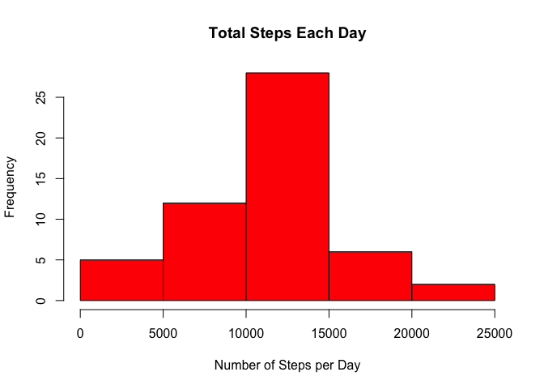
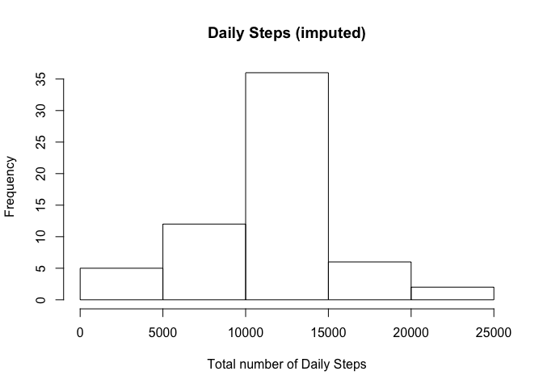
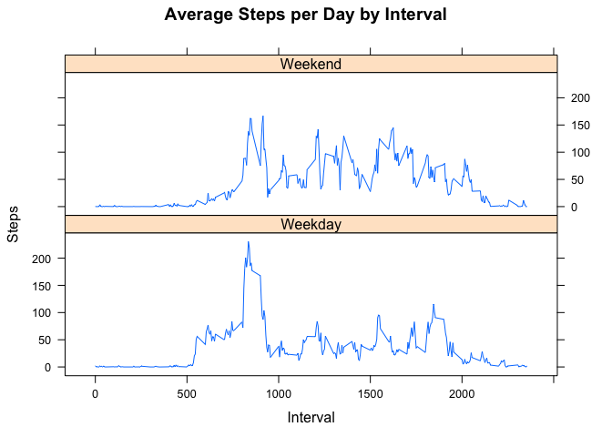

# Project 1 for Reproducible Research Coursera
Shannon McDaniel  


## **Load and Preprocessing the Data**

Load data into the dataframe and assign it to variable "data".


```r
data <- read.csv("activity.csv")
```
## **What is the mean number of total steps taken per day?**


```r
steps_per_day <- aggregate(steps ~ date, data, sum)

hist(steps_per_day$steps, main = paste("Total Steps Each Day"), col="red", xlab="Number of Steps per Day")
```

<!-- -->


```r
all_data_mean <- mean(steps_per_day$steps)
```

```r
all_data_median <- median(steps_per_day$steps)
```
---
### The mean is 1.0766 × 10^4 and the median is 10765.
---

## **What is the average daily activity pattern?**

*Calculate the total number of steps taken per day
*Plot the average number of steps per day by interval
*Find interval with most steps


```r
steps_by_interval <- aggregate(steps ~ interval, data, mean)
plot(steps_by_interval$interval,steps_by_interval$steps, type="l", xlab="Interval", ylab="Number of Steps",main="Average Number of Steps per Day by Interval")
```

<!-- -->

```max
max_interval <- steps_by_interval[which.max(steps_by_interval$steps),1]
```
### The 5 minute interval, **835**, contains the maximum number of steps per day.

## **Imputing missing values**

### Calculate and report the total number of missing values in the dataset (i.e. the total number of rows with 𝙽𝙰s)


```r
sum(is.na(data))
```

```
## [1] 2304
```
## **Total number of rows with NA's : 2304.**

### Replace NA's with the mean for the 5 minute interval.


```r
data_imputed <- data
for (i in 1:nrow(data_imputed)) {
        if (is.na(data_imputed$steps[i])) {
                interval_value <- data_imputed$interval[i]
                steps_value <- steps_by_interval[
                        steps_by_interval$interval == interval_value,]
                data_imputed$steps[i] <- steps_value$steps
                
        }
}
```

### **New data set created called data_imputed that is original data with all NA's replaced by mean of 5 minute interval.**

## **Calculate total number of steps each day with new data set.


```r
imputed_steps_per_day <- aggregate(steps ~ date, data_imputed, sum)
head(imputed_steps_per_day)
```

```
##         date    steps
## 1 2012-10-01 10766.19
## 2 2012-10-02   126.00
## 3 2012-10-03 11352.00
## 4 2012-10-04 12116.00
## 5 2012-10-05 13294.00
## 6 2012-10-06 15420.00
```


```r
hist(imputed_steps_per_day$steps, main="Daily Steps (imputed)", xlab="Total number of Daily Steps")
```

<!-- -->

### Mean and Median of imputed data set.

```r
mean_imp <- mean(imputed_steps_per_day$steps)
```

```r
median_imp <- median(imputed_steps_per_day$steps)
```
##**Calculate difference between imputed and non-imputed data.**

```r
mean_diff <- mean_imp - all_data_mean
med_diff <- median_imp - all_data_median
```

##**Calculate total difference.**

```r
total_diff <- sum(imputed_steps_per_day$steps) - sum(steps_per_day$steps)
```
*The imputed data mean is 1.059 × 104
*The imputed data median is 1.0766 × 104
*The difference between the non-imputed mean and imputed mean is -176.4949
*The difference between the non-imputed mean and imputed mean is 1.1887
*The difference between total number of steps between imputed and non-imputed data is 7.5363 × 104. Thus, there were 7.5363 × 104 more steps in the imputed data.

##**Are there differences in activity patterns between weekdays and weekends?**
###Create a plot to compare the number of steps on weekdays versus weekends. There are more steps on the weekend overall, but a burst of activity (steps) earlier in the weekdays.


```r
weekdays <- c("Monday", "Tuesday", "Wednesday", "Thursday", 
              "Friday")
data_imputed$dow = as.factor(ifelse(is.element(weekdays(as.Date(data_imputed$date)),weekdays), "Weekday", "Weekend"))

steps_by_interval_imp <- aggregate(steps ~ interval + dow, data_imputed, mean)

library(lattice)

xyplot(steps_by_interval_imp$steps ~ steps_by_interval_imp$interval|steps_by_interval_imp$dow, main="Average Steps per Day by Interval",xlab="Interval", ylab="Steps",layout=c(1,2), type="l")
```

<!-- -->

